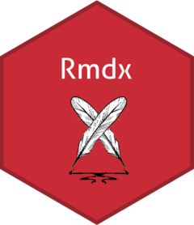

<!-- README.md is generated from README.Rmd. Please edit that file -->

# Rmdx 

```{r, include = FALSE}
knitr::opts_chunk$set(
  collapse = TRUE,
  comment = "#>",
  fig.path = "man/figures/README-",
  out.width = "100%"
)
```

# Rmdx: Different RMarkdown formats for different purposes

<!-- badges: start -->
<!-- badges: end -->

The goal of Rmdx is to ...

## Installation

Rmdx is not yet in CRAN.

<!-- You can install the released version of Rmdx from [CRAN](https://CRAN.R-project.org) with: -->

<!-- ``` r -->
<!-- install.packages("Rmdx") -->
<!-- ``` -->

You can install the development version from [GitHub](https://github.com/) with:

``` r
# install.packages("devtools")
devtools::install_github("drdsdaniel/Rmdx")
```
## Example

\TODO

## TODO

- HTML format

- DOCX format

- PDF format

- `exclude_r_in` to params
<!-- Necesito hacer que las funciones puedan acceder a los parámetros. -->
<!-- https://community.rstudio.com/t/how-to-solve-no-visible-binding-for-global-variable-note/28887 -->

- `author name` to footer credicts.

<!-- Se puede hacer que el html del footer se genere dinámicamente en cada corrida y se guarde en un archivo temporal. De esa forma el nombre para los créditos se pasa como un argumento a la función generadora de los formatos html. -->

- `cond_text` function
  
- html format with toc in lateral.
  
- add spanish language suport for tables and figures labels


<!-- Es importante observar que todo el código del proyecto debe ser compatible con los formatos que quieras utilizar. -->
  
