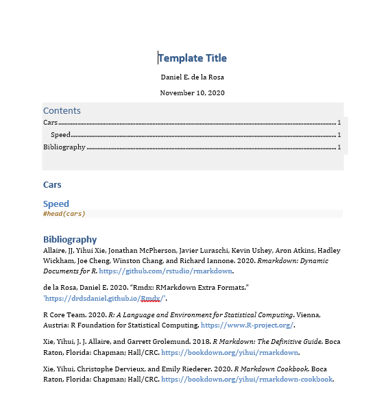
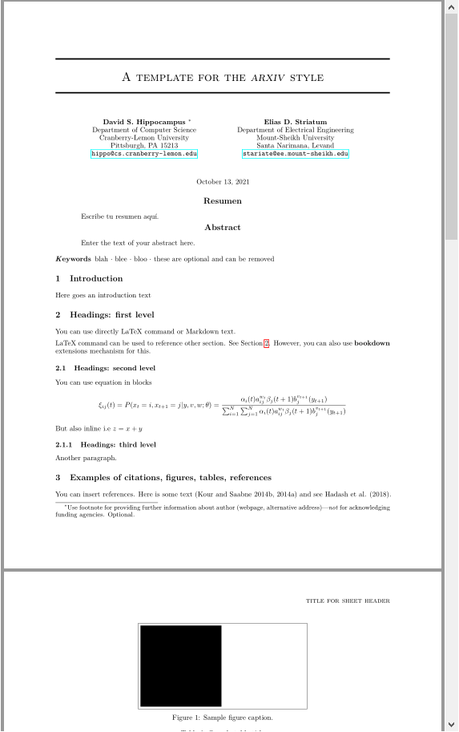

<!-- README.md is generated from README.Rmd. Please edit that file -->

# Rmdx: RMarkdwon extra formats 

```{r, include = FALSE}
knitr::opts_chunk$set(
  collapse = TRUE,
  comment = "#>",
  fig.path = "man/figures/README-",
  out.width = "100%"
)
```

<!-- badges: start -->
[](https://www.repostatus.org/#active)
[](https://github.com/drdsdaniel/Rmdx/actions)
[](https://www.tidyverse.org/lifecycle/#stable)
[](https://codecov.io/gh/drdsdaniel/Rmdx?branch=main)
[](https://CRAN.R-project.org/package=Rmdx)
<!-- badges: end -->

`Rmdx` provide very customize formats for Rmarkdown documents. The 3 main document availables are:

* rmxd_html
* rmdx_docx
* rmdx_pdf
* rmdx_paper

See examples for more details.

## Installation

Rmdx is not yet in CRAN.

<!-- You can install the released version of Rmdx from [CRAN](https://CRAN.R-project.org) with: -->

<!-- ``` r -->
<!-- install.packages("Rmdx") -->
<!-- ``` -->

You can install the development version from [GitHub](https://github.com/) with:

``` r
tryCatch(
  library(remotes),
  error = function(e){
    install.packages('remotes')
  }
)
remotes::install_github("drdsdaniel/Rmdx")
```

## Usage

If you are using RStudio, you can create a new Rmdx document from file menu: `File -> New file -> R Markdown -> From Template`.


> You need to have restarted RStudio at least once since the Rmdx installation.

If you are working outside of RStudio or the desired file has already been created, you just need to set the output in the yaml to be Rmdx: rmdx_html.

``` yaml
---
title: "Template Title"
author: "Daniel E. de la Rosa"
date: "`r format(Sys.Date(), '%B %d, %Y')`"
output: 
  Rmdx::rmdx_html:
    footer_name: 'Daniel E. de la Rosa'
    
toc-title: 'Contents'
fig_caption: true
bibliography: 'bibliography.bib' 
nocite: '@*' 
---
```

## Examples

### rmdx_html

Builded on top of [html_document2](https://rdrr.io/pkg/bookdown/man/html_document2.html). See [rmdx_html](https://drdsdaniel.github.io/Rmdx/reference/rmdx_html.html) reference page for additional details.


### rmdx_pdf

Builded on top of [pdf_document2](https://rdrr.io/pkg/bookdown/man/html_document2.html). See [rmdx_pdf](https://drdsdaniel.github.io/Rmdx/reference/rmdx_pdf.html) reference page for additional details.


### rmdx_docx

Builded on top of [rdocx_document](https://davidgohel.github.io/officedown/reference/rdocx_document.html). See [rmdx_docx](https://drdsdaniel.github.io/Rmdx/reference/rmdx_docx.html) reference page for additional details.



### rmdx_paper

Builded on top of [arxiv_article](https://pkgs.rstudio.com/rticles/reference/article.html). See [rmdx_paper](https://drdsdaniel.github.io/Rmdx/reference/rmdx_docx.html) details in reference page for additional info.



## crender

Rmdx also provide a template for easy start with [crender](https://github.com/drdsdaniel/crender) package.

## Roadmap

 These are some of the ideas that at the moment I plan to add to the package. Feel free to propose any change that you consider pertinent. Look at `Contributing` below to see how.


1. Make [rmdx_docx](https://drdsdaniel.github.io/Rmdx/reference/rmdx_docx.html) full compatible with [rdox_document](https://github.com/davidgohel/officedown/blob/master/R/rdocx_document.R)
2. Make a version of [rmdx_html](https://drdsdaniel.github.io/Rmdx/reference/rmdx_html.html) with float toc in the rmdx style
3. Add Spanish language support for some of the rmdx functions
4. Lots of changes to the [rmdx_pdf](https://drdsdaniel.github.io/Rmdx/reference/rmdx_pdf.html) format. To be notified on the fly.
5. Add "Blockquotes" format. ([rmdx_html](https://drdsdaniel.github.io/Rmdx/reference/rmdx_html.html))
6. Format warning and errors messages.([rmdx_html](https://drdsdaniel.github.io/Rmdx/reference/rmdx_html.html))
7. Go to top button. ([rmdx_html](https://drdsdaniel.github.io/Rmdx/reference/rmdx_html.html))
8. Paged HTML format.
9. The ability of embed additional information to HTML file, like external files, datasets or r session information. This information may be accessed like modals, via the toc (if available) or for clickable elements in the footer of doc. <!-- https://ijlyttle.github.io/bsplus/articles/modal.html#modal_markdown-title      APLICA PARA CRENDER, DE FORMA QUE EN UN FORMATO NO HTML SE CONVIERTA EN UN ANEXO-->
10. Add tests for pdf and docx formats


## Contributing

Have a feedback or want to contribute?

Please take a look at the [contributing guidelines](https://drdsdaniel.github.io/Rmdx/CONTRIBUTING.html) before filing an issue or pull request.

Please note that the Rmdx project is released with a [Contributor Code of Conduct](https://contributor-covenant.org/version/2/0/CODE_OF_CONDUCT.html). By contributing to this project, you agree to abide by its terms.
