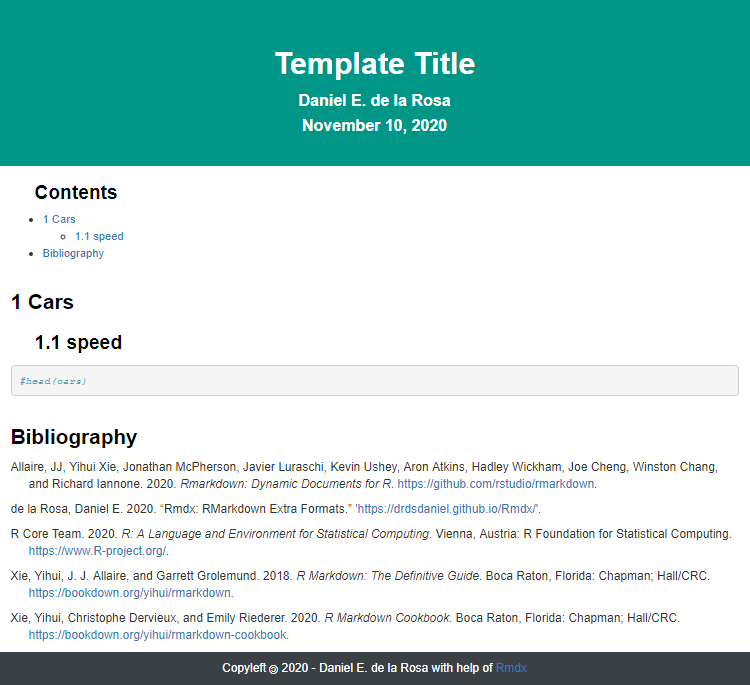
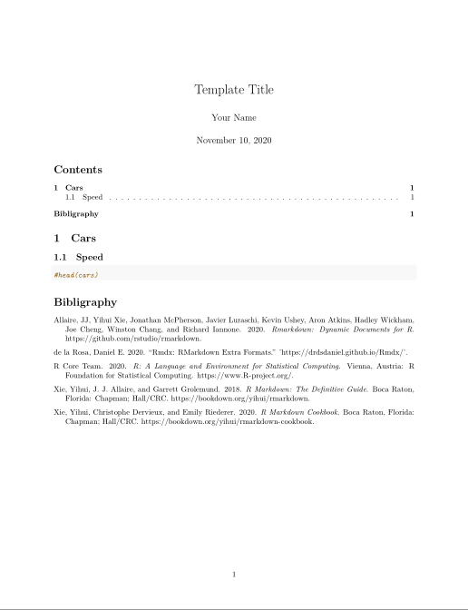

<!-- README.md is generated from README.Rmd. Please edit that file -->

# Rmdx: RMarkdwon extra formats 

<!-- badges: start -->

[](https://github.com/drdsdaniel/Rmdx/actions)
[](https://travis-ci.com/drdsdaniel/Rmdx)
[](https://codecov.io/gh/drdsdaniel/Rmdx?branch=main)
[](https://www.tidyverse.org/lifecycle/#maturing)
[](https://CRAN.R-project.org/package=Rmdx)
<!-- badges: end -->

## Installation

Rmdx is not yet in CRAN.

<!-- You can install the released version of Rmdx from [CRAN](https://CRAN.R-project.org) with: -->

<!-- ``` r -->

<!-- install.packages("Rmdx") -->

<!-- ``` -->

You can install the development version from
[GitHub](https://github.com/) with:

``` r
tryCatch(
  library(devtools),
  error = function(e){
    install.packages('devtools')
  }
)
devtools::install_github("drdsdaniel/Rmdx")
```

## Usage

If you are using RStudio, you can create a new Rmdx document from file
menu: `File -> New file -> R Markdown -> From Template`.


> You need to have restarted RStudio at least once since the Rmdx
> installation.

If you are working outside of RStudio or the desired file has already
been created, you just need to set the output in the yaml to be Rmdx:
rmdx\_html.

``` yaml
---
title: "Template Title"
author: "Daniel E. de la Rosa"
date: "November 10, 2020"
output: 
  Rmdx::rmdx_html:
    footer_name: 'Daniel E. de la Rosa'
    
toc-title: 'Contents'
fig_caption: true
bibliography: 'bibliography.bib' 
nocite: '@*' 
---
```

## Examples

### rmdx\_html

Builded on top of
[html\_document2](https://rdrr.io/pkg/bookdown/man/html_document2.html).
See
[rmdx\_html](https://drdsdaniel.github.io/Rmdx/reference/rmdx_html.html)
reference page for additional details.



### rmdx\_pdf

Builded on top of
[pdf\_document2](https://rdrr.io/pkg/bookdown/man/html_document2.html).
See
[rmdx\_pdf](https://drdsdaniel.github.io/Rmdx/reference/rmdx_pdf.html)
reference page for additional details.



### rmdx\_docx

Builded on top of
[rdocx\_document](https://davidgohel.github.io/officedown/reference/rdocx_document.html).
See
[rmdx\_docx](https://drdsdaniel.github.io/Rmdx/reference/rmdx_docx.html)
reference page for additional details.


## TODO

<!-- https://github.com/davidgohel/officedown/blob/master/R/rdocx_document.R -->

  - html format with toc in lateral.

  - add spanish language support for tables and figures labels
